# Weather Now
<div align="center">
<h2>Table of contents</h2>
<h6>Project Introduction</h6>
<h6>Purpose of the Application / Development rationale</h6>
<h6>Target audience</h6>
<h6>Features</h6>
<h6>Future enhancements</h6>
<h6>Project folder structure</h6>
<h6>Installation & User Guide</h6>
<h6>Troubleshooting</h6>
<h6>Known Issues / Limitations</h6>
<h6>Testing documentation</h6>
<h6>Screenshots</h6>
<h6>External libraries used</h6>
<h6>Application Flowchart</h6>
<h6>Data Flow Diagram</h6>
<h6>Attribution</h6>
</div>

## Project Introduction
Weather Now is a lightweight Python application that lets a user quickly check real‑time weather conditions through either a graphical interface or a command‑line tool. The project demonstrates practical API integration, modular code structure, and a polished user experience.
The graphical user interface (GUI), built with PyQt5, provides an intuitive interface for entering a city and instantly viewing temperature and descriptive weather details. For users who prefer terminal workflows, the command-line (CLI) mode offers a simple dataset manager that can fetch, store, list, and delete weather entries.
Weather Now is built to be easy to run, understand, and to extend. It is an example of:  

• 	API use,   
• 	GUI development with PyQt5,  
• 	CLI design with argument parsing,  
• 	Simple project structure and maintainable code,  
• 	Real‑world practices such as configuration file management and data persistence.

## Purpose of the app / Development rationale
Weather Now was built to explore how real‑time data, clean UI design, and modular Python architecture can come together in a practical, everyday tool. The project demonstrates how to integrate external APIs, manage configuration securely. It delivers the same functionality through a graphical interface and a command‑line.
The app answers a simple question—“What’s the weather like right now?”
The project also serves as a learning platform, showcasing how Python applications can be packaged and deployed in a way that mirrors real‑world development standards.

## Target audience
Weather Now is designed for a broad range of users:

• 	Everyday users who want a quick simple way to check current weather conditions without navigating ads or cluttered websites.  
• 	Developers and students looking for a reference project that demonstrates API integration, PyQt5 GUI design, CLI tooling, and modular Python structure.  
• 	Educators and reviewers assessing code documentation, reproducibility, and adherence to best practices.  
• 	Command‑line enthusiasts who prefer scriptable weather lookups directly from the terminal.  
• 	Learners exploring Python environments who want to understand how virtual environments, configuration files, and dependency management work in practice.  

## Features
•  Dual Interface (GUI and CLI)  
•  Real‑Time Weather Data (Fetches the current temperature from the OpenWeather)  
•  Configuration‑driven setup  
•  API key and default settings stored in a  file  
•  Keeps sensitive data out of version control  
•  Isolated Virtual Environment  
•  Modular codebase  
•  Clear separation between API logic, UI components, and CLI handlers  
•  Easy to extend or integrate into other projects.

## Future Enhancements
Weather Now is basic, but there are several improvements planned to expand its capabilities and refine the user experience. These enhancements aim to make the application more informative, customizable, and adaptable to different user styles. 

#### -7‑Day Forecast Support
Extend weather lookup with multi‑day forecasts, to include temperature trends, precipitation probability, wind patterns, air quality, etc.

#### -Search History & Favorites  
Allow users to save frequently checked locations and quickly revisit previous searches in both GUI and CLI modes.  

#### -Auto-complete for city names. 

#### -Improved Error Handling & Offline Mode  
Provide clearer feedback when API requests fail and offer a fallback mode that displays the last known weather data.  

#### -Unit & Language Customization  
Add support for switching between metric/imperial system of units, and multiple UI languages. 

#### Timestamp display for weather data
Extract the time field from the API response and convert it to local time. Display a formatted timestamp in both GUI and CLI modes. Include timestamps in saved dataset entries for clarity.

#### -Enhanced GUI Features  
Introduce icons, themes, and layout improvements to make the interface more visually engaging and accessible.  

#### -Dark/light theme toggle

#### -Animated transitions

#### -Packaging & Distribution  
Package the app as a standalone executable for Windows, making installation easier for non‑technical users.  

#### -Plugin‑Friendly Architecture  
Explore a modular system where additional data sources (e.g., air quality, UV index, sunrise/sunset times) can be added as optional extensions.

## Project folder structure
weather_now/
```
├── weather_now.py         # Main GUI + CLI entry point
├── weather_api.py         # API communication module
├── cli.py                 # CLI logic
├── run.py                 # Simple launcher used for testing the virtual environment
├── styles.qss             # GUI stylesheet
├── creds.json             # User-provided API key (not included in repo)
├── weather_history.json   # CLI dataset (ignored)
├── .flake8                # Linting configuration for enforcing consistent code style

├── requirements.txt       # Python dependencies
├── .gitignore             # Files and folders excluded from Git tracking
└── README.md              # Project documentation
```

## Installation & User Guide
#### Requirements
• 	Python v3.10 or later  
• 	Internet connection (for API requests)  
• 	OpenWeatherMap API key  
• 	Required Python packages: `PyQt5` `requests`

#### Installation
**Clone the repository:**  
`git clone https://github.com/<your-username>/weather_now.git`
`cd weather_now`  
Install the required dependencies:
`pip install -r requirements.txt` This installs:  

• 	PyQt5 — for the GUI.  
• 	requests — for API communication.  

**API Key setup (Required):**  
Weather Now uses the OpenWeather API.
Before running the app, create a file named:
`creds.json`.
Place it in the project root with the following structure:
`{
    "api": {
        "key": "YOUR_API_KEY_HERE"
    }
}`
You can obtain a free API key from:
https://openweathermap.org/api.  
If the key is missing or invalid, the app will run but will display an error when fetching weather data.

#### Running the Graphical User Interface
To launch the graphical user interface, enter:  
`python weather_now.py`  

The GUI allows you to:

• 	Enter a city name.  
• 	Fetch current temperature data.  
• 	View temperature in °C and °F.  
• 	See weather conditions with emojis.  
• 	Read a short description of weather conditions.   

Weather Now also includes a command‑line interface for managing a simple weather dataset.

#### Run in command-line mode:  
`python weather_now.py --cli`  

Commands
| Command          | Description                               |
|------------------|-------------------------------------------|
| `add <city>`     | Fetches weather for a city and saves it   |
| `list`           | Displays all saved weather entries        |
| `delete <index>` | Removes an entry by its list number       |
| `exit`           | Exits the CLI mode                        |

The dataset is stored in:  
`weather_history.json`  

This file is ignored by Git to avoid committing user‑sensitive data.

#### Usage Notes 
•  If the API key is missing or invalid, the app will show a clear error message.  
•  If the city name is empty or incorrect, the app will notify the user.  
•  If the internet connection is unavailable, the app will display a connection error.  
•  The button disables during loading to prevent duplicate requests.  
•  The app uses an external stylesheet (`style.qss`) for visual styling.

#### Troubleshooting
|Issue              |Cause                        |Solution                  |
|-------------------|-----------------------------|--------------------------|
|"API key missing"  |creds.json missing or invalid|Recreate creds.jsson      |
|"City not found"   |Invalid city name            |Check spelling           |
|"Connection Error" |No internet                  |Reconnect and retry       |
|No styling applied |Missing `style.qss`          |Add or recreate stylesheet|

## Known Issues / Limitations
The following limitations are known or expected:

<div align="left">
1. The GUI performs network requests on the main thread
</div>
This may cause temporary freezing during slow or unstable connections.  
PyQt’s event loop can only do one thing at a time, so while the network request is happening:

• The window cannot repaint  
• Buttons cannot be clicked  
• The OS may mark the window as “Not Responding”  
• Animations or loading indicators cannot run

_Why it matters_:  
If the API is slow or the user has poor internet connection, the app feels unresponsive.

<div align="left">
2. No retry logic or offline fallback
</div>  
If the network drops mid‑request, the app shows an error and stops. There is no:

• Retry button  
• Automatic retry  
• Cached last‑known weather  
• Offline mode  

*Why it matters*:  
Users on unstable internet connections may get errors even though retrying would succeed.

<div align="left">
3. API key stored in plain text
    
</div>

*Why it matters*:  
• Plaintext API keys can be stolen  
• Malware can read local JSON files

<div align="left">
4. Missing timestamp display for weather data    
The application currently does not display the time and date associated with the weather data returned by the API. This affects both:
</div>  

• 	Live weather requests (current weather)  
• 	Saved searches

_Why it matters_:  
• 	Weather conditions change rapidly, and users may assume the data is more recent than it actually is.  
• 	Saved searches become ambiguous without knowing when they were recorded.  
• 	If the API request fails and cached data is shown in the future, the user won’t know how old it is.  
• 	Timezone differences (e.g., querying Tokyo from Germany) are not communicated.

## Testing documentation  
Manual Testing Table — (PyQt5/GUI)
| Test ID | Scenario                            | Steps                                        | Expected Result                          | Actual Result |Status|
|---------|-------------------------------------|----------------------------------------------|------------------------------------------|---------------|------|
| T1      | Application launches                |Run `weather_now.py`                          |GUI window opens with all widgets visible |As expected    |  ✅  |
| T2      | Empty city input                    |Leave input blank<br>→Click "Get Weather"     |Error: “Please enter a city name.”        |As expected    | ✅   |
| T3      | Missing creds.json                  |Remove/rename creds.json<br>→ click button    |Error: “API key missing…”                 |As expected    |  ✅  |
| T4      | Invalid JSON in creds               |Break JSON syntax<br>→ run app                |Error: “API key missing…”                 |As expected    | ✅  |
| T5      | Missing API key field               |Remove `key` from creds.json                  |Error: “API key missing…”                 |As expected    | ✅   |
| T6      | Invalid API key                     |Enter fake key<br>→ search city               |Error: “Unauthorized: Invalid API key”    |As expected    |  ✅  |
| T7      | Valid city                          |Enter, for example “London”<br>→ click button |Weather data displayed                    |As expected    |  ✅  |
| T8      | Invalid city                        |Enter for example “asdfgh”<br>→ click button  |Error: “City not found”                   |As expected    |   ✅ |
| T9      | No internet                         |Disable internet connection<br> → click button|Error: “Connection Error…”                |As expected    | ✅   |
| T10     | API timeout                         |Simulate slow network                         |Error: “Timeout Error…”                   |As expected    |  ✅  |
| T11     | API server error                    |Force 500 response                            |Error: “Server error…”                    |Not Achieved   |  ❌  |
| T12     | Loading state                       |Click button                                  |Button shows “Loading…” and disables      |As expected    |  ✅  |
| T13     | Button restores                     |After request completes                       |Button returns to normal                  |As expected    |  ✅  |
| T14     | Emoji mapping                       |Test weather types                            |Correct emoji displayed                   |As expected    |  ✅  |
| T15     | Temperature conversion              |Compare °C/°F                                 |Correct conversion shown                  |As expected    |  ✅  |
| T16     | Missing stylesheet                  |Remove style.qss                              |Console warning, but app still works      |Not Achieved   |  ❌  |
| T17     | Press `Enter` on keyboard to search |Type city<br>→ press Enter                    |Same as clicking button                   |As expected    |  ✅ |
| T18     | Error clears on success             |Trigger error<br>→ then valid city            |Error label clears                        |As expected    |  ✅ |
| T19     | Weather clears on error             |Show weather<br>→ then trigger error          |Weather labels clear                      |As expected    |  ✅ |
| T20     | Application exit                    |Close window                                  |App exits cleanly                         |As expected    | ✅  |
|T21      | Invalid characters in city name     |Input invalid character(s)<br><br>→ click button|Invalid city name.                      |As expected    |  ✅ |  

## Screenshots
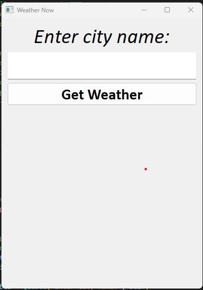
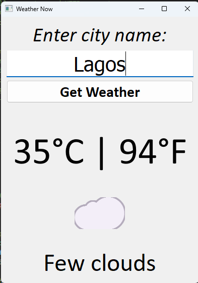
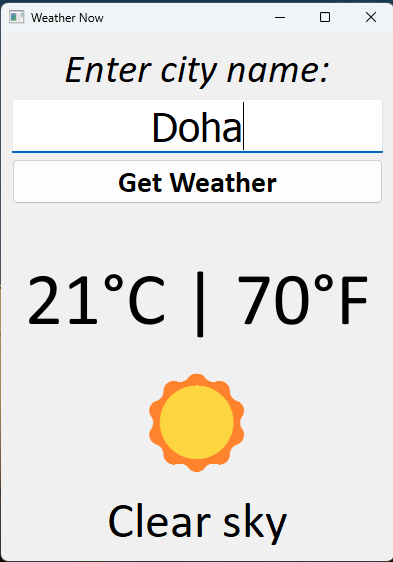
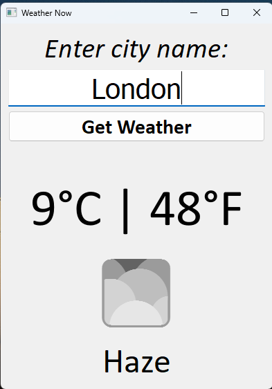
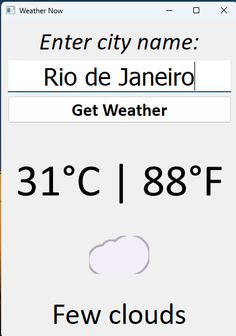
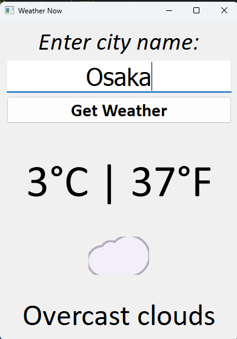
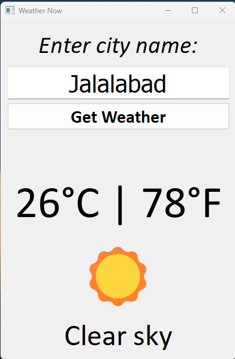
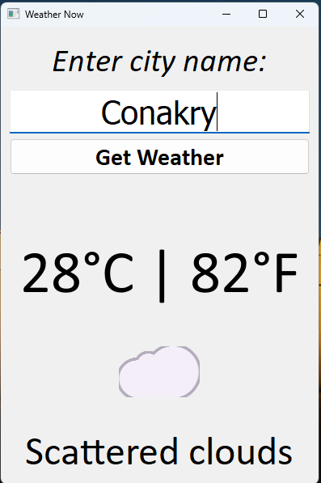
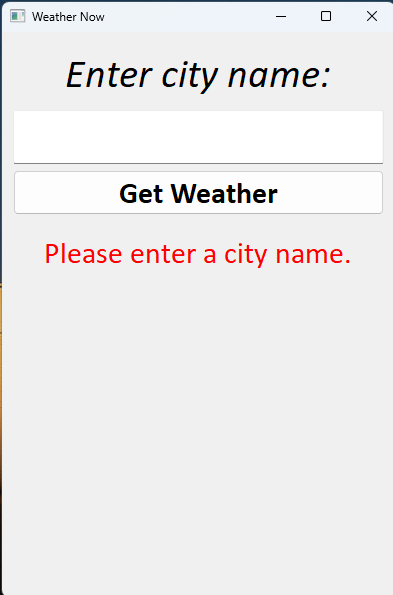
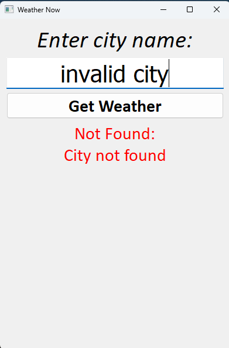
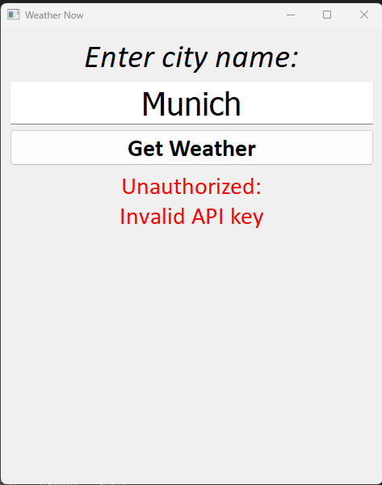
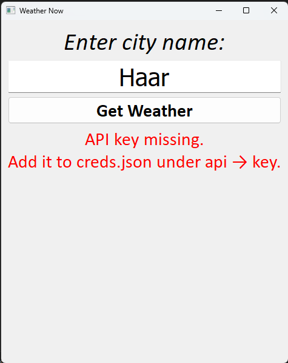
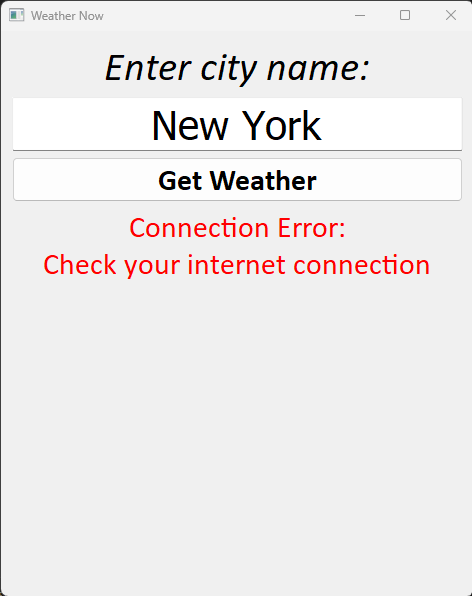

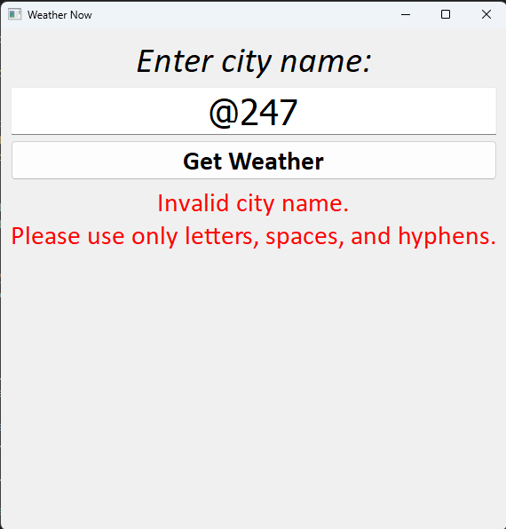
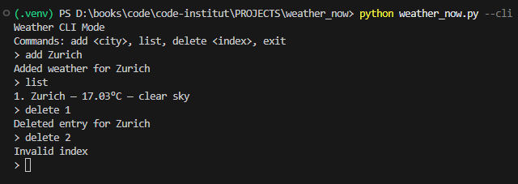

## External libraries used
| Library  | Purpose | Installation |
|----------|---------|--------------|
| **PyQt5** | Used to build the GUI | `pip install PyQt5` |
| **requests** | Handles HTTP requests to the OpenWeather API | `pip install requests` |

## Application Flowchart (PyQt5 GUI)
The following flowchart illustrates the core logic behind Weather Now, showing how the application processes user input, retrieves data from the OpenWeather API, and displays results in both GUI and CLI modes. This visual overview helps clarify the internal structure of the project and highlights how each component interacts within the overall system.
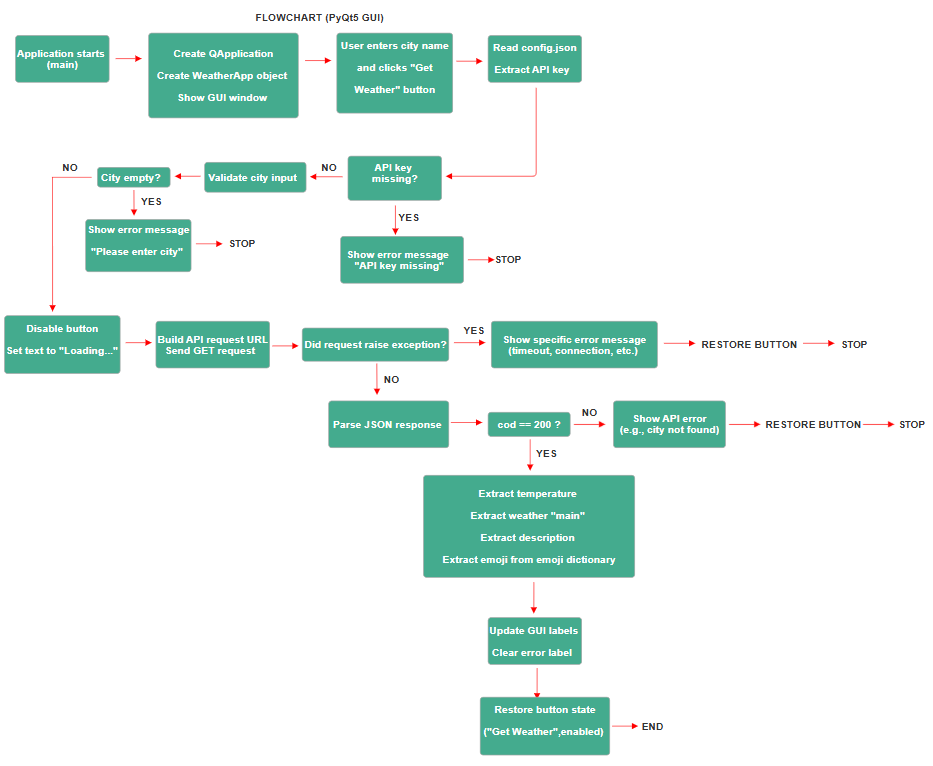

## Data Flow Diagram
The Data Flow Diagram (DFD) provides a high‑level view of how information moves through Weather Now, from user input to API communication and final output. It highlights the major data sources, processing steps, and outputs that make up the core functionality of the application.
This diagram helps clarify how the system handles requests, transforms raw API data, and delivers weather information through both the GUI and CLI interfaces.
[Data flow diagram](docs/dataflow.pdf)

## 📝 Attribution

Weather Now uses the following external services and resources:

- **OpenWeather API** — Provides real-time weather data used by both the GUI and CLI modes.  
  https://openweathermap.org/

- **httpstat.us** — Used during development to simulate HTTP error responses (e.g., 500, 503, 504) for testing the app’s error-handling logic.  
  https://httpstat.us/

- **PyQt5** — GUI framework used to build the desktop interface.  
  https://www.riverbankcomputing.com/software/pyqt/

- **Requests library** — Handles HTTP communication with the weather API.  
  https://docs.python-requests.org/

All other code, logic, and design decisions were created as part of the Weather Now project.


